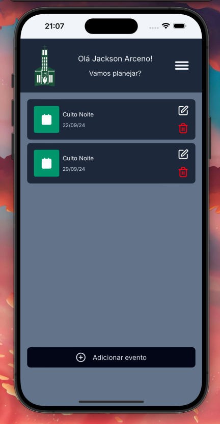
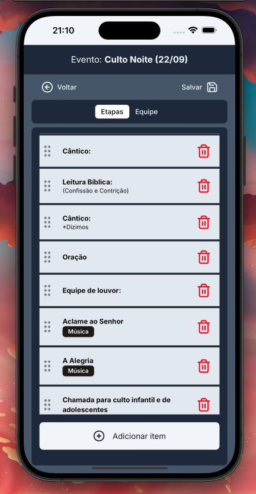
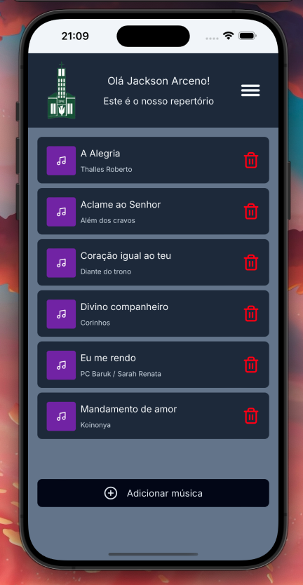

# IPE

An web app (PWA) to manage events, musics and people in the Presbyterian Church from Estreito/Floripa(SC)

[](https://github.com/JacksonFA/ipe/actions/workflows/migirations.yml)

## Features

- Events view: Visualize your events calendar
- Music Library: Manage the church's music repertoire
- Member Directory: Keep track of church worship members and their information
- Planning Tools: Organize and plan church activities

<div style="display: flex;">
  
  
  

</div>

## Prerequisites

- Docker
- Node >=20.12
- Yarn

## Getting Started

First of all, setup the .env file copying the content of .env.example to a new file named ".env":

```bash
  cp .env.example .env
```

Installing dependencies:

```bash
  yarn
```

Setting up database:

```bash
  docker compose up -d

  yarn migrate:up
```

Running the app:

```bash
  yarn dev
```

Now, open [http://localhost:3000](http://localhost:3000) with your browser to see the result.
